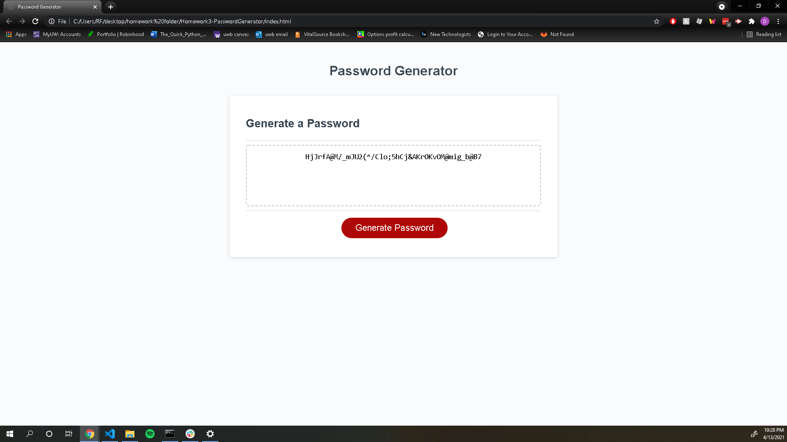

# Homework3-PasswordGenerator

## Description
The goal of this project was to create a password generator that would produce a secure password for an employee looking to obtain a secure password.

Although this was a tough project, I'm glad I had the chance to complete it because it allowed me to learn the valuable lesson of breaking my code down step by step and carefully analyzing what is being asked from the computer in each line. 

## Usage
To use the website, you simply press the red button that says "Generate Password" on it, then you follow the instructions which are given to you.
Below you will see a screenshot of what the website looks like after a password is generated

